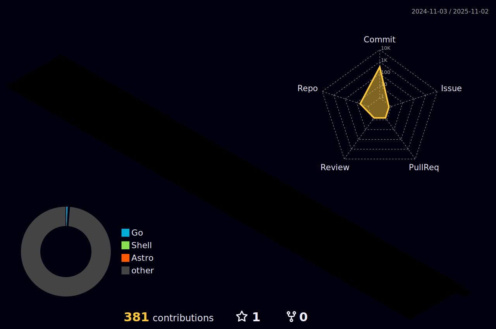

## 你好，欢迎来我的github主页，你是这里的第  个访客
我是NAN，一个前端开发工程师  
这是我的博客地址: [epxort-nan.work](epxort-nan.work)  
希望你在这里中找到灵感  

<!--  -->

<picture>
  <source media="(prefers-color-scheme: dark)" srcset="https://raw.githubusercontent.com/open-nan/open-nan/output/github-contribution-grid-snake-dark.svg" />
  <source media="(prefers-color-scheme: light)" srcset="https://raw.githubusercontent.com/open-nan/open-nan/output/github-contribution-grid-snake.svg" />
  
</picture>
